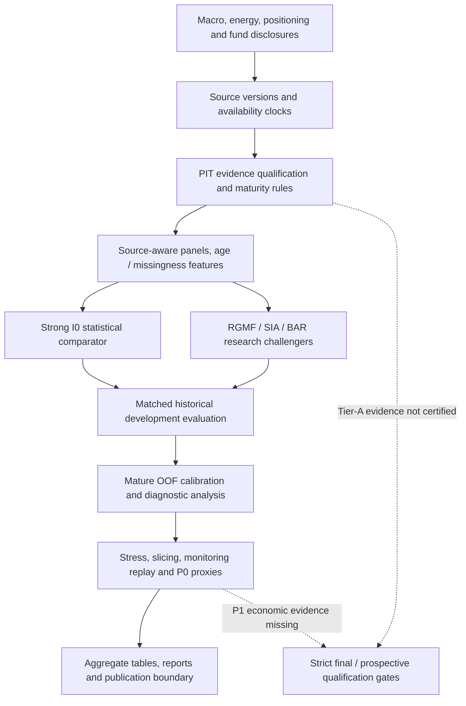

# Research architecture (conceptual)

This diagram summarizes the public code structure. It is **not** a certified
production data pipeline or proof that every research gate has passed.

## Code map

| Layer | Public paths | What is in scope |
|---|---|---|
| Source clocks and panels | `src/signalforge/pit.py`, `src/signalforge/data.py`, `src/signalforge/track_inputs.py` | Release-aware selection and historical eligibility rules |
| Forecast evaluation | `src/signalforge/metrics.py`, `src/signalforge/v33_sia.py`, `studies_v3/` | Quantile loss, temporal resampling and research model variants |
| Calibration | `calibration_v34/` | Mature OOF experiments with reported negative calibration outcomes |
| Model risk | `model_risk_v38/`, `diagnostics_v3/` | Slicing, disagreement, stress, chronological dry-run monitoring and P0 proxies |
| Strict evidence gates | `qualification_v35/`, `p1_pit_readiness_v34/` | Boundary checks that may explicitly block final claims |
| Public evidence | `evidence/aggregates/`, `evidence/reports/` | Selected aggregate outputs and narrative reports |

Historical results use **reconstructed Tier-B source clocks**. The project's
scientific freeze, strict source qualification, genuine forward tests and
executed trading economics are not established by this public snapshot.
For a quick executable entry point, see [public quickstart](QUICKSTART.md).
